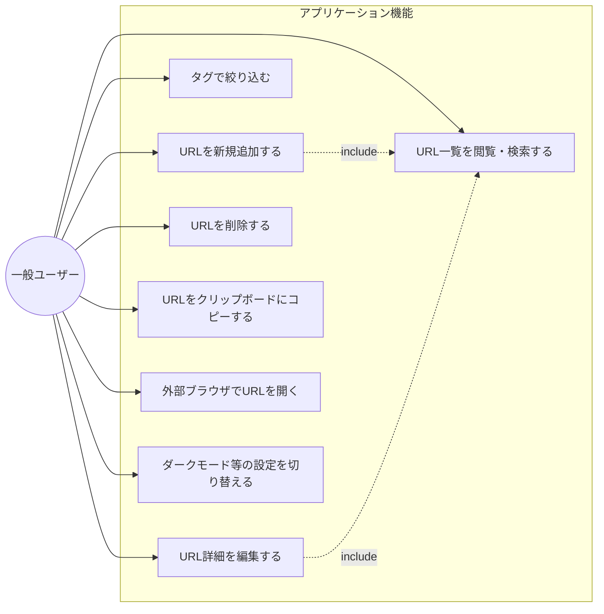
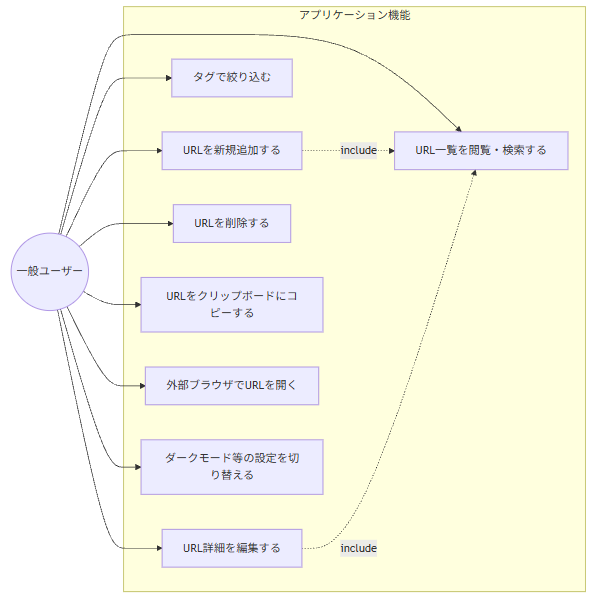
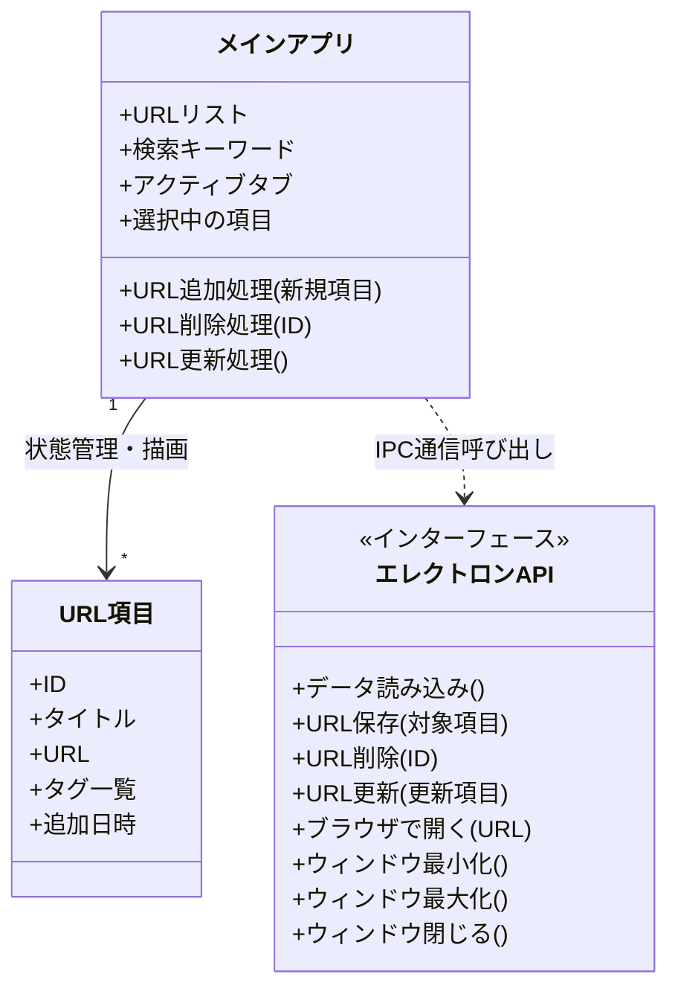
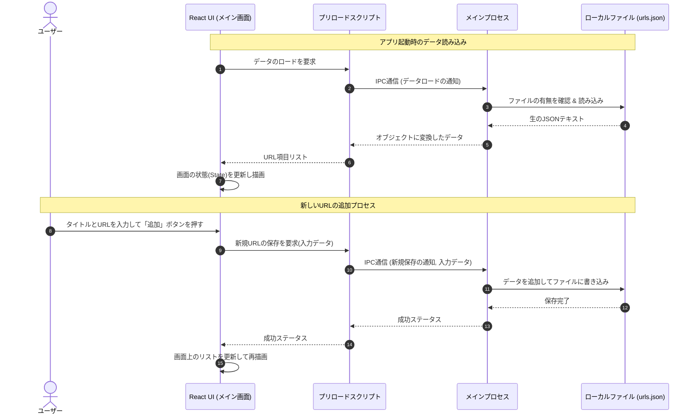
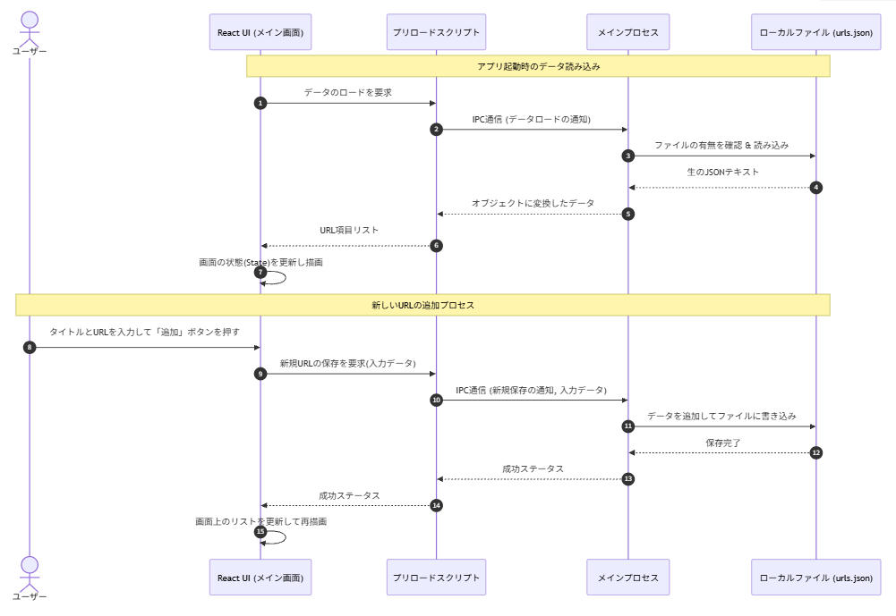
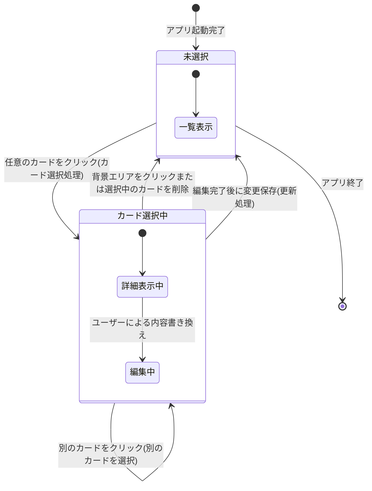
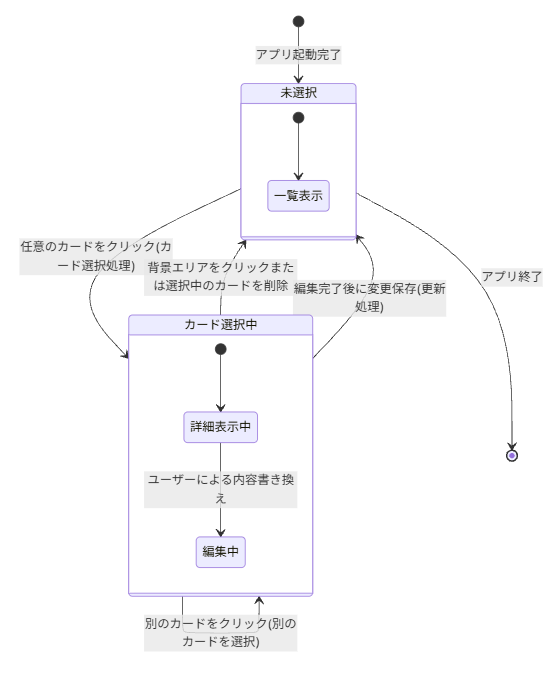

# URL Manager (Electron + React + TypeScript)

日々の開発作業や調べ物で増え続けるWebサイトのURLを効率的に登録、タグ付け、管理するための軽量デスクトップアプリケーションです。

## 1. 要件定義書

### 【目的】

散らかりがちな技術ドキュメントやリファレンスのURLを、ジャンルごとにタグを付けて素早く登録・整理し、1クリックでコピーや外部ブラウザ起動を行えるようにして、個人の開発やブラウジング効率を向上させます。

### 【利用者の入出力】

- **入力**: URL、タイトル、タグ情報（カンマ区切りまたは個別入力）、検索キーワード
- **出力**: 登録されたURLカードの一覧、タグによる絞り込みリスト、選択したURLの詳細・編集エリア、トースト通知（登録・更新・コピー成功時）

### 【制約】

- **プラットフォーム**: Electronベースのデスクトップアプリ（Windows/Linux対応、WSLg/Wayland環境も含む開発コンテナをサポート）
- **技術スタック**: React (v19) + TypeScript + Electron + TailwindCSS / shadcn-ui (Viteによるビルド)
- **永続化**: ローカルファイルシステム上の単一のJSONファイル（`urls.json`）による管理とし、ログインやクラウド同期、外部サーバー連携は行わない。

### 【受け入れ基準】

1. **URLの保存**: 「新しいURLを追加」ダイアログから、タイトル、URL、タグを入力して追加でき、保存したデータがアプリ再起動時にも保持されていること。
2. **一覧・フィルタ機能**: 登録されたすべてのURLがカード形式で表示され、タグによる即時絞り込み、およびタイトル・URL部分一致による検索が行えること。
3. **URLの編集と削除**: 任意のカードをクリックして右ペインで詳細内容（タイトル、URL、個別タグの追加/削除）を直接変更・保存でき、カード右上のゴミ箱アイコンから削除ができること。
4. **クイック操作**: カード上のコピーボタンをクリックした際に、URLがクリップボードへ保存され（トースト通知を表示）、URLリンクをクリックした際には外部の規定ブラウザで対象サイトが開くこと。

### 【非目標（今回は作らない範囲）】

- ユーザーログイン機能およびマルチアカウント管理
- 予算管理や外部API等によるWebサイトメタデータの自動スクレイピング取得（お気に入り登録はタグ機能の `#お気に入り` 運用で代替）
- スマートフォン向けなどのモバイルアプリ対応、およびWebブラウザ単体（サーバーホスティング）での動作

---

## 2. 機能一覧と優先度・非機能要求

### 機能要求（優先度付き）

| 分類         | 機能名                    | 詳細・CRUD対象                                                                    | 優先度 |
| ------------ | ------------------------- | --------------------------------------------------------------------------------- | ------ |
| コア機能     | URLの新規登録 (Create)    | ダイアログからタイトル、URL、カンマ区切りタグを登録し `urls.json` に保存する      | 高     |
| コア機能     | URL一覧表示 & 検索 (Read) | メイン画面中央にカード形式で全件・検索結果を表示。タイトルとURL部分一致で絞り込み | 高     |
| コア機能     | URL詳細編集 (Update)      | 右ペインでタイトル・URLの変更、タグの個別編集（Enter追加/xボタン削除）ができる    | 高     |
| コア機能     | URLの削除 (Delete)        | カード右上の削除ボタンからURLデータを物理削除し、詳細表示もリセットする           | 高     |
| コア機能     | タグフィルタ (Read)       | 左ペインに全データから重複なく抽出したタグ一覧を自動表示し、クリックで絞り込む    | 中     |
| サポート機能 | クリップボードコピー      | カード上のボタンをクリックすると、URL文字列を即座にコピーする                     | 高     |
| サポート機能 | 外部ブラウザ遷移          | URLリンククリック時、Electronの `shell.openExternal` を利用して既定ブラウザで開く | 高     |
| サポート機能 | ダークモード切替          | 左下のModeToggleから、Light / Dark / System テーマの切り替えを行える              | 中     |

### 非機能要求

- **性能 (Performance)**:
- ローカルファイル（JSON）のI/O処理は非同期（IPC通信）で行い、数千件程度のURLリスト読み込み時もUIスレッド（レンダラープロセス）がフリーズしないこと。

- **セキュリティ (Security)**:
- `contextIsolation: true` および `nodeIntegration: false` を有効化し、レンダラープロセスに生Node.js APIを直接露出させず、限定的なIPCチャネルのみを開放すること。

- **ユーザビリティ (Usability)**:
- shadcn-uiを採用したモダンなインターフェースの提供、ウィンドウリサイズ時のレスポンシブな3ペインレイアウト、ウィンドウのリサイズ状態（サイズ）保持。

- **保守性 (Maintainability)**:
- Vite、ESLint、Prettierによる静的検証、およびDockerfile / `.devcontainer` による一貫した仮想Linux GUI環境の提供。

---

## 3. 設計図（Mermaid記法による4種のモデル）

### 3.1 ユースケース図風フロー





### 3.2 クラス図（データ構造）




### 3.3 シーケンス図（データの読み込み・保存）





### 3.4 状態遷移図（UI・選択アイテム状態）





---

## 4. COSMIC CFP (機能規模見積もり)

COSMIC法に基づき、データの移動（**Entry (入力)**, **Exit (出力)**, **Read (読み込み)**, **Write (書き込み)**）を基準に本アプリの機能規模を精密に見積もります。

> **基準**: 1データ移動 ＝ 1 CFP (Cosmic Functional Point)

### 1) アプリ起動時の初期化・データ読み込み

- **Read**: `urls.json` ファイルからのURLデータ読み取り (1 CFP)
- **Read**: ウィンドウサイズ・位置情報の履歴読み取り (1 CFP)
- **Read**: テーマ設定（ダーク/ライト）の読み取り (1 CFP)
- **Exit**: メインプロセスからレンダラー（React）へ初期データ（URL・設定）の一括送信 (1 CFP)
- **Exit**: React側でのタグ一覧の自動集計および左ペインへの描画 (1 CFP)
- **Exit**: メイン画面（URLカード一覧）の描画 (1 CFP)
- **合計**: **6 CFP**

### 2) URLアイテムの新規登録 (Create)

- **Entry**: UI上の追加ダイアログからのフォーム入力（タイトル、URL、タグ文字列）(1 CFP)
- **Entry**: メインプロセスへの保存用IPCメッセージ送信 (1 CFP)
- **Read**: 既存のJSONデータの読み込み (1 CFP)
- **Write**: 新規データを追加して `urls.json` へ保存書き込み (1 CFP)
- **Exit**: 完了トーストメッセージの描画 (1 CFP)
- **Exit**: 追加されたデータを反映したカード一覧およびタグリストの再描画 (1 CFP)
- **合計**: **6 CFP**

### 3) URLアイテムの詳細表示・編集・更新 (Update)

- **Entry**: 一覧からカードを選択（詳細ペインへのデータ流し込み） (1 CFP)
- **Entry**: 詳細画面での編集データ入力および保存ボタン押下 (1 CFP)
- **Entry**: メインプロセスへの更新用IPCメッセージ送信 (1 CFP)
- **Read**: 現在の `urls.json` の読み込み (1 CFP)
- **Write**: 該当アイテムを上書きして `urls.json` へ保存書き込み (1 CFP)
- **Exit**: 更新完了トーストの表示 (1 CFP)
- **Exit**: 詳細ペインおよびメイン一覧、タグリストの再描画 (1 CFP)
- **合計**: **7 CFP**

### 4) URLアイテムの削除 (Delete)

- **Entry**: 削除ボタン押下および確認ダイアログの操作 (1 CFP)
- **Entry**: 削除対象IDのIPCメッセージ送信 (1 CFP)
- **Read**: 既存データの読み込み (1 CFP)
- **Write**: 指定IDを除外して `urls.json` へ保存書き込み (1 CFP)
- **Exit**: 削除完了後の再描画（一覧の更新、詳細ペインの初期化） (1 CFP)
- **Exit**: 削除完了トースト通知の表示 (1 CFP)
- **合計**: **6 CFP**

### 5) 外部ブラウザ連携・クリップボードコピー (Utility)

- **Entry**: コピーボタンのクリック（対象URLデータの特定） (1 CFP)
- **Write**: システムクリップボードへのテキスト書き込み (1 CFP)
- **Exit**: コピー成功トースト通知の表示 (1 CFP)
- **Entry**: URLリンクのクリック（外部ブラウザ起動要求） (1 CFP)
- **Exit**: `shell.openExternal` による外部ブラウザへのURL引き渡しと起動 (1 CFP)
- **合計**: **5 CFP**

### 6) ウィンドウ制御・システム設定（テーマ等）

- **Entry**: ウィンドウの最小化/最大化/閉じるボタンの操作 (1 CFP)
- **Write**: ウィンドウが閉じられる直前のサイズ・位置情報を設定ファイルへ書き込み (1 CFP)
- **Entry**: ダークモード/ライトモードの切り替え操作 (1 CFP)
- **Write**: 変更されたテーマ設定の保存書き込み (1 CFP)
- **Exit**: アプリ全体のテーマ（スタイル）の即時切り替え適用 (1 CFP)
- **合計**: **5 CFP**

---

**見積もり合計総規模**: **35 CFP**

---

---

## 5. セットアップと起動方法

### 前提条件

- Docker / VS Code (Dev Containerを使用する場合)
- WSL2 (Windows環境、WSLgによるGUI表示に対応)

### 開発環境での起動・パッケージ（.exe）ビルド手順

このプロジェクトでは、開発中の動作確認（ホットリロード）と、実際に配布可能な `.exe` ファイルを作成して起動する確認の2通りが可能です。

VS Code でプロジェクトを開き、Dev Container（「**Reopen in Container**」）を起動した状態で、コンテナ内ターミナルから以下の手順を実行します。

#### A. 開発用サーバーでの簡易起動（ホットリロード有効）

コードを書き換えながらリアルタイムで動作を確認したい場合に使用します。

```bash
# 依存関係のインストール
npm ci

# 開発用ローカルサーバーの起動 & Electron起動
npm run dev

```

#### B. 本番ビルドを実行して `.exe` を直接起動する（推奨）

実際の配布環境と同様に、パッケージ化されたアプリケーションとして動かしたい場合に使用します。

1. **プロダクション用にビルドおよびパッケージングを実行**

```bash
# Viteビルドを行い、electron-builderでWindows向けディレクトリ（.exe等）を出力
npm run pack

```

_(※内部的には `electron-vite build && electron-builder --win dir` が実行されます)_ 2. **生成された `.exe` の起動**
ビルドが成功すると、プロジェクトのルートディレクトリに `dist/win-unpacked/` が生成されます。その中にある実行ファイルを直接起動します。

```bash
# パッケージ化されたアプリケーションの実行
./dist/win-unpacked/URL-Manager.exe

```
